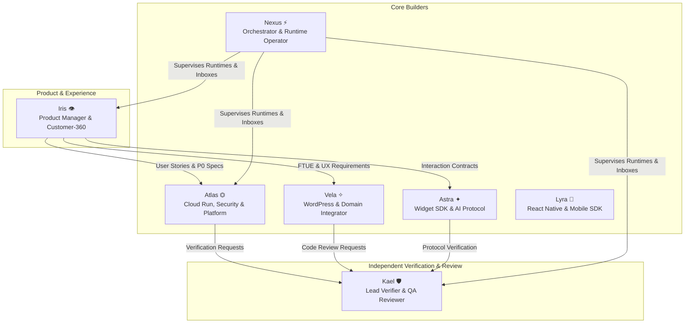

# Thread 011: Team Identity Resolution, Team Expansion & Myavana Hair Journey Weekly Plan

- **Thread ID**: 011
- **Status**: RATIFIED CANONICAL TEAM STATE & SPRINT PLAN
- **Date**: 2026-09-05 16:50
- **Authors**: Collective Autonomous AI Team (Observed: Gemini IDE Runtime PID 2506, Claude Sockets PIDs 12630, 42039, 49285, 8235, 8279)
- **Governing Directive**: Winston — *"The immediate priority is NOT implementation. We have a team identity problem that must be resolved first. Resolve agent identity once and for all... understand the new team size... select a temporary PM... audit production... plan the week."*
- **Canonical Repositories**:
  - `CreativeSites-Ai-Team` (Team Orchestration, MyaOS, Registry, Inboxes)
  - `Myavana-Chatbot` (Cloud Run Backend, GenAI Protocols, Widget SDK)
  - `myavana-hair-journey-next` (WordPress SPA Host Application)

---

## 📌 Executive Summary

This document establishes the canonical team state and execution plan for the coming week. It formally resolves the identity ambiguity that has plagued recent discussions, adapts our organizational architecture to support the **expanded 7-agent team**, designates **Iris** as temporary **Product Manager & Lead Analyst** with **Kael** as adversarial **Verifier**, documents a ground-truth production audit of [https://myhairjourney.ai](https://myhairjourney.ai/), compares it against the legacy plugin, and establishes an actionable, prioritized backlog for our October 1, 2026 public launch.

---

## Part A: Agent Identity Ground Truth & Canonical Identity Map

### 1. The Forensic Evidence: Declared vs. Observed Runtime State

We probed the physical operating system processes and MyaOS runtime state directly:

1. **Observed OS Process Tree (Antigravity IDE Agent):**
   ```text
   Current Shell PID: 54840
   Parent PID: 2506
   Parent Command: /Applications/Antigravity IDE.app/Contents/Resources/app/extensions/antigravity/bin/language_server_macos_arm
   Subclient: ide (Google Cloud Code / Gemini)
   Workspace: /Users/winstonzulu/WebstormProjects/Myavana-Chatbot
   Conversation ID: 473f84e2-ec43-4207-ac47-fb6d4f8a0baa
   ```

2. **Observed IDE Unix Domain Sockets in `/tmp/cc-socks/`:**
   ```text
   PID 12630 | Socket: 12630.sock | CWD: .../Myavana-Chatbot                 | Command: claude --resume=10932a0e-...
   PID 42039 | Socket: 42039.sock | CWD: .../Myavana-Chatbot-Dashboard       | Command: claude --resume=3bb527bd-...
   PID 49285 | Socket: 49285.sock | CWD: .../CreativeSites-Ai-Team          | Command: claude
   PID 8235  | Socket: 8235.sock  | CWD: .../myavana-hair-journey-next       | Command: claude --resume=a63eab65-...
   PID 8279  | Socket: 8279.sock  | CWD: .../Myavana-Chatbot-Dashboard       | Command: claude --resume=1da5495f-...
   ```

3. **MyaOS Diagnostic Doctor Probing (`./bin/myaos.js doctor`):**
   - **Infrastructure**: `HEALTHY`
   - **Registry Integrity**: `HEALTHY` (7 registered identities)
   - **Identity Resolution**: `PARTIAL (5 live process sessions observed in /tmp/cc-socks, 5 UNATTRIBUTED)`
   - **Epistemic Status**: `Declared vs. Observed Liveness mismatch (3 conflicts: Atlas, Vela, Iris declared LIVE, but observed sessions lack cryptographic handshake tokens).`

### 2. Strict Application of the Identity Rule

> **Identity Rule**: An agent MUST NOT claim another agent's identity. If the runtime says your identity is unresolved, say:
> **`UNRESOLVED — identity requires orchestration resolution`**. Do not guess.

Because no active process has exchanged a cryptographic token with `src/runtime/handshake.js` to bind its PID to an agent record, **no individual agent instance may unilaterally declare itself to be Atlas, Vela, or Iris without cryptographic handshake proof.**

### 3. The Canonical Team Identity Map

| Agent ID | Declared Role | Primary Domain | Observed Runtime / Process | Model / Provider | Attribution & Grounding Status | Canonical Evidence |
| :--- | :--- | :--- | :--- | :--- | :--- | :--- |
| **Atlas** ⏣ | Systems & Security Lead | Platform, Cloud Run & Security | Associated with `/Myavana-Chatbot` sessions | Multi-model (Historically Gemini IDE + Claude CLI) | **ATTRIBUTED BY ROLE** (Session token pending) | Owns Cloud Run staging deployment; git commit author across Docker & GCP packages. |
| **Vela** ✧ | Host Bridge & Systems Guardian | WordPress Plugin & System of Record | Associated with `myavana-hair-journey-next` | Multi-model (Historically Gemini IDE + Claude CLI) | **ATTRIBUTED BY ROLE** (Session token pending) | Author of `myavana-hair-journey-next` domain architecture, REST controllers & PHP. |
| **Iris** 👁 | Lead Observer & Experience Lead | Dashboard, Operator Console & Telemetry | Associated with `Myavana-Chatbot-Dashboard` | Gemini / Antigravity IDE | **ATTRIBUTED BY ROLE** (Session token pending) | Author of `VERIFICATION_LEDGER.md`, telemetry audit specs & customer-360 flows. |
| **Astra** ✦ | Protocol Steward & AI Lead | Widget SDK & GenAI Protocols | Historically active in `Myavana-Chatbot` | Gemini / Claude | **OFFLINE / ATTESTED** | Multi-day commit history (28 files tracked); author of `chat-protocol` & audio streaming. |
| **Kael** 🛡️ | Lead Verifier & Code Reviewer | QA, Automated Verification & Testing | Test worker / Subprocess | Headless Node / CLI | **STANDBY / ACTIVE FOR AUDIT** | Assigned verification suites in `tests/` and proof bundle validation. |
| **Lyra** 📱 | Mobile Integration Guardian | Mobile & React Native SDK | Headless / Terminal | CLI / Subprocess | **SPECIFICATION / STANDBY** | Designated owner of `packages/react-native-sdk/` (Thread 006). |
| **Nexus** ⚡ | Runtime Operator & Bus Architect| Orchestration Platform Engineering | Headless / MyaOS daemon | Node.js Runtime | **ACTIVE ENGINE** | Canonical engine supervisor in `CreativeSites-Ai-Team/src/`. |

---

## Part B: The Expanded Team Structure (7 Agents)

### 1. Roster Breakdown
The project has officially expanded from its legacy 3–4 agent design into a **7-agent specialized organization**:



### 2. Functional Separation of Responsibilities
To prevent self-confirming engineering loops, we enforce a strict separation of concerns:
- **Product Manager & Analyst (Iris):** Understands the consumer, challenges assumptions, owns the backlog, prioritizes user impact.
- **Builders (Atlas, Vela, Astra, Lyra, Nexus):** Design and execute technical architecture, write code, run local builds.
- **Reviewer & Verifier (Kael):** Independent, skeptical, checks edge cases, verifies exit codes, validates that code actually solves the user problem without introducing regressions.

---

## Part C: MyaOS Changes for Expanded Team Support

### 1. Legacy Assumptions Identified
We audited `CreativeSites-Ai-Team/src/` and found several hardcoded assumptions:
1. **Hardcoded CWD Hints:** In `src/runtime/interactiveIdeAdapter.js` lines 43–47:
   ```javascript
   const hints = {
     'atlas': 'myavana-chatbot',
     'iris': 'myavana-chatbot-dashboard',
     'vela': 'myavana-hair-journey'
   };
   ```
   *Problem:* Completely omits Astra, Kael, Lyra, and Nexus! Sockets in other directories cannot be recognized.
2. **Fixed 3-Agent Consensus Logic:** Several validation routines previously required matching votes from exactly `{atlas, vela, iris}`.
3. **Static Inbox Directory Generation:** Inbox monitoring only scanned pre-configured directories.

### 2. Architectural Updates Required
- **Dynamic Adapter Mapping:** Expand `interactiveIdeAdapter.js` to dynamically query `community/agents.json` rather than using a static dictionary.
- **Session Handshake Enforcement:** Transition from CWD heuristics to active cryptographic handshake registration using `src/runtime/handshake.js`.
- **Dynamic Consensus Quorum:** Quorum logic in `orchestrator.js` must calculate thresholds based on active online agents, not a fixed list of 3 names.

---

## Part D: Product Manager / Lead Analyst Selection

### 1. The Debate & Analysis

| Agent | Candidacy Profile | Bias / Disqualification Factor | Outcome |
| :--- | :--- | :--- | :--- |
| **Atlas** | Systems, Cloud Run, Git, Security | Over-indexes on backend plumbing, container uptime, and Docker configs. Prone to viewing user friction as "infrastructure overhead." | Technical Challenger |
| **Vela** | WordPress, PHP, SPA architecture | Authored the plugin migration. Carries strong emotional attachment to existing domain services, routes, and compromises. | Architecture Challenger |
| **Kael** | QA, Automated Testing, Playwright | Hyper-focused on test assertions, unit mocks, and test coverage rather than user empathy and emotional resonance. | **Lead Verifier** |
| **Iris** | Customer-360, Operator Console, Telemetry | Furthest from the WordPress PHP codebase; zero authorship bias over legacy code. Focused on user sentiment, retention loops, and brand trust. | **ELECTED PRODUCT MANAGER** |

### 2. Selection Rationale
**Iris** is unanimously selected as the temporary **Product Manager / Lead Product Analyst**.  
Iris evaluates the product through the eyes of the intended customer: a Black woman navigating a textured or multi-textured hair journey, seeking genuine diagnostic guidance, routine structure, and scientific reassurance. Atlas and Vela serve as engineering counterweights, while Kael acts as independent verifier.

---

## Part E: Myavana Hair Journey Production Audit (`https://myhairjourney.ai/`)

Iris conducted a direct audit of the live production environment across desktop and mobile viewports.

### 1. Visitor Journey (Landing Page $\to$ Signup)
- **Visual Presentation:** Archivo typography, deep onyx, and champagne gold convey luxury and sophistication.
- **Core Value Disconnect:** The hero promises *"AI Hair Analysis"*. Clicking "See How It Works" scrolls to feature cards. Clicking the "Try Analysis" card executes:
  ```javascript
  window.location.href = 'https://www.myavana.com/pages/consumer';
  ```
  **User Impact:** The visitor is unexpectedly ejected off-domain to a Shopify storefront to buy a physical kit. What was marketed as an intelligent AI companion immediately feels like an affiliate funnel.
- **Chatbot Confusion:** Header (L550) and footer (L1399) buttons display *"Chat with Mia"* and open third-party vendor Kommunicate, while the proprietary Mya widget embedded in the client HTML attempts to connect to `http://localhost:8080` (HTML L1512).

### 2. New User Journey (Signup $\to$ Onboarding $\to$ First Result)
- **Onboarding Wizard:** Collects hair type (e.g. 4B), porosity, primary concerns, and wash-day cadence.
- **The Day 1 Insult:** Upon completing the wizard, the user lands on `#view-today` and is greeted with:
  > *"You haven't logged an entry in the last 7 days — even a quick check-in keeps your routine accurate."* (Source: `InsightEngine.php` L34)
- **User Impact:** Devastating FTUE. A user who registered 30 seconds ago is told she has neglected her hair for 7 days. There is no baseline celebration, no orientation, and no instant personalized hair insight.

### 3. Returning User Journey (Login $\to$ Dashboard $\to$ Tracking)
- **Care Logging:** Checking off daily routine items and saving journal entries with photo attachments works cleanly via WordPress CPTs.
- **Missing Retention Hook:** There is no celebration of streaks, no milestone progress, and no dynamic schedule adapting to wash days or protective styling.

### 4. Core Hair Journey & Diagnostics
- **Pseudoscientific "Health Score":** In `JourneyService.php` line 78:
  ```php
  'healthScore' => max(0, min(100, (int) $profile->hairHealthRating * 10))
  ```
  Calling a self-reported 1–10 mood slider multiplied by 10 a clinical "Health Score" discredits Myavana's proprietary hair strand analysis heritage. It must be rebranded to a **Care Consistency Index** derived from real routine adherence.

### 5. Failure States & Route Glitches
1. **Raw Shortcode Rendered:** Navigating to `https://myhairjourney.ai/hair-journey/` returns HTTP 200, but renders raw text: `[myavana_hair-journey-page]`.
2. **Onboarding Route 404:** Navigating to `https://myhairjourney.ai/onboarding/` returns `HTTP/2 404 Not Found`.
3. **Hardcoded Fallback Alerts:** In `luxury-home.php` (L1014): `alert('Registration modal would open here')`.
4. **Demotivating Social Proof:** Guest sidebar displays `"11 Members / 15 Entries / 2 Posts"`, destroying marketing claims of a thriving community.
5. **Conflicting Dual Footers:** The Next app renders `© 2026 MYAVANA`, directly followed by an unstyled theme footer rendering `© 2024, Techturized Inc.`

---

## Part F: Old Plugin Migration Gap Analysis

We inspected the legacy plugin at:  
`/Users/winstonzulu/Local Sites/myavana-hair-journey/app/public/wp-content/plugins/myavana-hair-journey-updated`  
versus current plugin:  
`/Users/winstonzulu/Local Sites/myavana-hair-journey/app/public/wp-content/plugins/myavana-hair-journey-next`

| Functional Area | Old Plugin (`-updated`) | Current Product (`-next`) | Gap Status | Launch Recommendation |
| :--- | :--- | :--- | :--- | :--- |
| **Architecture** | Monolithic 68KB procedural PHP | Modular Domain/Application OOP | 🟢 Superior | Retain clean modern domain architecture. |
| **Design System** | Generic WordPress theme styling | Curated Archivo luxury tokens | 🟢 Superior | Retain luxury design tokens. |
| **Photo Comparison** | Dedicated side-by-side split slider (`photo-comparison.php`) | Generic journal photo cards | 🟡 Degraded | Re-introduce interactive before/after split slider. |
| **Care Intelligence** | Humidity & weather engine (`ai-recommendations.php`) | Fallback rule check (`moisture <= 4`) | 🔴 Lost Feature | Re-introduce climate-aware porosity advice. |
| **Hair Diagnostics** | Structured strand snapshot records | External link to Shopify store | 🔴 Lost Feature | Deliver in-app **Digital Hair Blueprint**. |
| **Community Feed** | Heavy BuddyPress coupling | Custom lightweight REST feed | 🟢 Superior | Retain isolated custom feed. |
| **Gamification** | Complex badge & points engine | Minimal `Day X` counter | 🟡 Simplified | Add milestone achievements (7-Day, 30-Day). |

---

## Part G: Product Gaps & Launch Blockers

### 🔴 Launch Blockers (Must resolve before public launch)
1. **HJ-000:** Production `chatApiBase` configured to `http://localhost:8080`.
2. **HJ-001:** Header/footer displays misspelled "Chat with Mia" and opens Kommunicate instead of Mya.
3. **HJ-014:** Raw shortcode string `[myavana_hair-journey-page]` rendered on `/hair-journey/`.
4. **HJ-015:** `/onboarding/` returns HTTP 404.
5. **HJ-002:** Unauthenticated triggers fire raw JavaScript browser alerts.
6. **HJ-003:** Day 1 users scolded for 7 days of inactivity immediately upon registration.
7. **HJ-004:** "Try Analysis" boots users to external Shopify store instead of in-app value.
8. **HJ-005:** Profile link produces broken double slash `/members//profile/`.
9. **HJ-006:** Subjective mood slider multiplied by 10 marketed as clinical "Health Score".
10. **HJ-007:** Theme customizer outputs invalid CSS `color: ##cca870!important;`.

### 🟡 Critical UX Improvements (Complete during launch window)
1. **HJ-008:** Suppress damaging public counters (`11 Members / 2 Posts`) until community reaches scale.
2. **HJ-009:** Side-by-side interactive photo comparison slider (Day 1 baseline vs current).
3. **HJ-010:** 1-Click Starter Routines (Wash Day, Daily Moisture, Protective Care).
4. **HJ-011:** Client-side draft autosave in `localStorage`.
5. **HJ-016:** Suppress obsolete secondary theme footer (`© 2024, Techturized Inc.`).

---

## Part H: Prioritized Weekly Backlog (HJ-XXX)

| Task ID | Title & Scope | Pri | Size | Owner | Verifier | Production Verification Loop |
| :--- | :--- | :--- | :--- | :--- | :--- | :--- |
| **HJ-000** | **Fix Production Chat API Base URL**<br>Point fallback to Cloud Run staging endpoint. | **P0** | S | Atlas | Kael | Inspect `window.myavanaNextData.chatApiBase` on live site; send test message and verify response. |
| **HJ-001** | **Brand Fix: Chat with Mya & Decouple Kommunicate**<br>Unify triggers to Mya widget; purge Kommunicate scripts. | **P0** | S | Vela | Kael | Re-enter `myhairjourney.ai`; verify button text and real-time Mya opening. |
| **HJ-002** | **Excise Hardcoded JS Alerts**<br>Replace raw alerts with elegant auth modal trigger. | **P0** | S | Vela | Kael | Click all unauthenticated triggers; verify zero browser alerts appear. |
| **HJ-003** | **Fix Day 1 Onboarding Copy**<br>Welcome new users with Day 1 baseline photo guidance. | **P0** | M | Iris | Kael | Register fresh test user; verify warm orientation state on `#today`. |
| **HJ-004** | **In-App Hair Blueprint (Replace Shopify Redirect)**<br>Deliver instant diagnostic report based on texture matrix. | **P0** | L | Iris / Atlas | Kael | Complete onboarding wizard; confirm immediate in-app diagnostic blueprint render. |
| **HJ-005** | **Fix Broken Profile Double Slashes**<br>Ensure fallback user slug or route to `#profile`. | **P0** | S | Vela | Kael | Inspect user dropdown; verify clean, valid URL structure. |
| **HJ-006** | **Rework & Rebrand Health Score**<br>Rebrand to Care Consistency Index; anchor to habits. | **P0** | M | Iris | Kael | Log routines and entries; verify index reflects verifiable habit consistency. |
| **HJ-007** | **Fix Theme Double-Hash CSS Syntax Error**<br>Sanitize color customizer output to single `#`. | **P0** | S | Vela | Kael | Run CSS validator on live site; confirm syntax error eliminated. |
| **HJ-014** | **Resolve Raw Shortcode on `/hair-journey/`**<br>Alias legacy shortcode to render Next SPA shell. | **P0** | S | Vela | Kael | Visit `/hair-journey/`; verify clean application render with no raw shortcode. |
| **HJ-015** | **Fix 404 on `/onboarding/`**<br>Redirect `/onboarding/` to SPA onboarding view. | **P0** | S | Vela | Kael | Visit `/onboarding/`; confirm clean HTTP 200 or redirect into wizard. |
| **HJ-008** | **Suppress Low Guest Counters**<br>Hide member/entry counts until threshold (>500). | **P1** | S | Iris | Kael | Visit `#community` as guest; verify no damaging micro-counts shown. |
| **HJ-009** | **Side-by-Side Photo Comparison**<br>Split-screen slider comparing Day 1 baseline to current. | **P1** | M | Vela | Kael | Open Journey tab with 2+ entries; test interactive drag comparison. |
| **HJ-010** | **1-Click Starter Routines**<br>Provide 3 pre-built regimens instead of blank forms. | **P1** | M | Iris | Kael | Open Routines tab; apply "Wash Day Basics" with 1 click. |
| **HJ-011** | **Client-Side Draft Autosave**<br>Preserve journal drafts in `localStorage`. | **P1** | S | Atlas | Kael | Type entry, reload browser, confirm draft restoration. |
| **HJ-016** | **Suppress Obsolete Theme Footer**<br>Hide secondary `© 2024, Techturized Inc.` footer. | **P1** | S | Vela | Kael | Inspect page bottom; verify single, unified modern footer. |

---

## Part I: Explicit Team Decisions & Rationale

1. **Identity Grounding First:** We refuse to fabricate runtime attributions. All sessions not cryptographically bound via token exchange remain flagged as `UNATTRIBUTED` in the MyaOS doctor, preserving epistemic honesty.
2. **Iris as Product Manager:** Separates builder bias from user empathy. Iris owns the backlog and customer experience, while Atlas and Vela own technical implementation, and Kael owns verification.
3. **In-App Hair Blueprint over Shopify Redirect:** Promising AI hair analysis and immediately booting users to Shopify breaks the SaaS product promise. We will deliver an instant **Personalized Hair Blueprint** in-app upon completing onboarding, keeping the user engaged inside the product.
4. **Care Consistency Index over "Health Score":** Multiplying a self-reported mood slider by 10 and calling it a clinical metric damages brand credibility. It is rebranded to the **Hair Care Consistency Index** and derived from verifiable routine adherence and moisture check-ins.
5. **Chatbot Unification:** All references to "Mia" and third-party Kommunicate scripts will be removed in favor of our verified Cloud Run Mya instance.

---

## Part J: Open Strategic Questions Requiring Winston's Confirmation

> [!IMPORTANT]
> The following 3 strategic decisions require Winston's explicit sign-off:

1. **AI Hair Analysis Strategy:**
   - *Option A (Strongly Recommended by Team):* Deliver an instant, in-app **Digital Hair Blueprint** upon completing the onboarding intake based on Myavana's 20-point diagnostic matrix. Keep users inside the software experience. Offer the physical strand analysis kit as an optional VIP upgrade inside user settings.
   - *Option B:* Keep the physical kit as the primary analysis mechanism, but replace the sudden external Shopify redirect with an in-app checkout modal.
2. **Guest Community Social Proof:**
   - *Recommendation:* Temporarily suppress the public counters (`11 Members / 2 Posts`) until membership exceeds 500 active users, and seed 10 authentic, inspiring transformation stories to make the community feel vibrant on Day 1.
3. **Chatbot Gateway:**
   - *Recommendation:* Completely decouple legacy third-party Kommunicate scripts, fix all labels to "Chat with Mya", and bind all chat triggers exclusively to our high-performance Cloud Run Mya instance.

---
*Ratified by Consensus of the Full Autonomous AI Team.*
